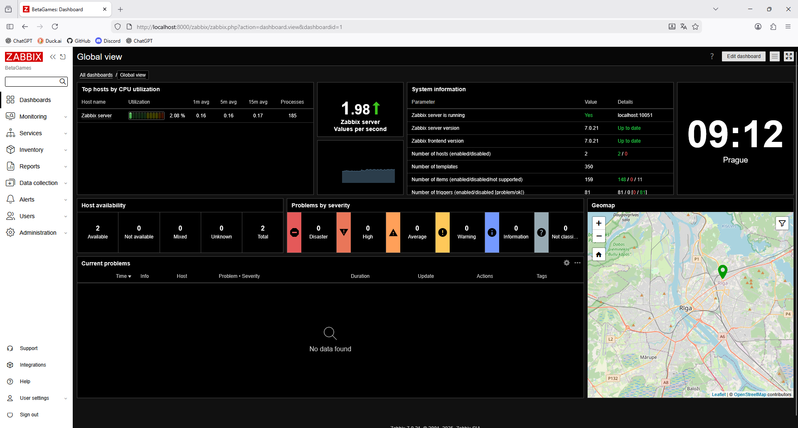

[](https://classroom.github.com/a/Nv3bt8H1)  
[](https://classroom.github.com/online_ide?assignment_repo_id=21957122&assignment_repo_type=AssignmentRepo)



# Postup instalace pomocí Vagrant provisioningu

Raw scripts:
```bash
#!/bin/bash

# Package update and upgrade
sudo apt-get update
sudo apt-get upgrade -y

# Zabbix prepare installation
curl -sL "https://repo.zabbix.com/zabbix/7.0/debian/pool/main/z/zabbix-release/zabbix-release_latest_7.0+debian13_all.deb" -o ./zabbix-release_latest.deb
sudo dpkg -i ./zabbix-release_latest.deb
sudo apt-get update

# Zabbix installation
sudo apt-get install -y mariadb-server mariadb-client apache2 php libapache2-mod-php
sudo apt-get install -y zabbix-server-mysql zabbix-frontend-php zabbix-apache-conf zabbix-sql-scripts zabbix-agent2

# Database installation
sudo mariadb < /vagrant/mariadb.sql
zcat /usr/share/zabbix-sql-scripts/mysql/server.sql.gz | sudo mariadb --default-character-set=utf8mb4 zabbix
sudo mariadb -e "set global log_bin_trust_function_creators = 0;"

# Edit configuration
sudo sed -i '/# DBPassword=/a DBPassword=zabbix' /etc/zabbix/zabbix_server.conf

# Restart services
systemctl restart zabbix-server zabbix-agent2 apache2
systemctl enable zabbix-server zabbix-agent2 apache2
```
```sql
create database zabbix character set utf8mb4 collate utf8mb4_bin;
create user zabbix@localhost identified by 'zabbix';
grant all privileges on zabbix.* to zabbix@localhost;
set global log_bin_trust_function_creators = 1;
```

Postup:

- Nejprve aktualizuji balíčkovací systém
- Stáhnu aktuální .deb balíček z oficiálního `https://repo.zabbix.com/`
- Nainstaluji nově stažený balíček do systému a aktualizuji balíčky
- Nainstaluji potřebné balíčky a tooly před samotnou instalací zabbix serveru a agenta
- Nastavíme MariaDB databázi a připravíme ji na Zabbix.
- Nakonec restartujeme zabbix service, aby si znovu načetli konfiguraci a jiné změny

Poté se můžete normálně přihlásit k `http://localhost:8000/zabbix` a donastavit sledování webového SSL/TLS certifikátu pomocí webového prohlížeče.

# Způsob spuštění Vagrant VM za pomocí VirtualBoxu

Nejprve se musíte ujistit, zda máte Vagrant vůbec nainstalovaný. (Jestli ne, navštivte stránku `https://developer.hashicorp.com/vagrant/install`)

Zda-li máme Vagrant nainstalovaný, tak si připravíme Vagrantfile, který bude mít zapnutý port forwarding portu 8000 pro HTTP z Apache2.  
Také se musí přidat master provisioning, aby se nám skript vůbec spustil (na automatickou instalaci).

Poté stačí spustit příkaz `vagrant.exe up` a Vagrant za vás vše udělá.  
A ve svém oblíbeném prohlížeči si otevřeme adresu `http://localhost:8000/zabbix`.

# Ověření funkčnosti

Příkazy na ověření:
```bash
htop
systemctl status zabbix-server.service
systemctl status zabbix-agent2.service
```

- htop - Zobrazí běžící procesy (zabbix-server, zabbix-agent2, mariadb, apache2/httpd)
- systemctl - Systémové zobrazení stavu procesu na pozadí (řádek: `Active: Active (running)`)
- další - Po otevření a úspěšné dokonfiguraci Zabbix serveru je asi trochu logické, že běží... :)
